  

> *Se você quiser fazer uma torta de maçã do zero, você primeiro precisa inventar o universo.*

### Em construção

- **[UniversePie](https://github.com/Rafael-CRL/UniversePie)**: cartões de vocabulário gerados a partir do que já foi estudado no Anki
- **[Lambada](https://github.com/Rafael-CRL/lambada)**: leitura de pauta e notas no braço do violão

---

 <i>everything worth saying, and everything else as well, can be said with two characters</i>  contato: <a href="mailto:rafaelcristolobato@gmail.com">rafaelcristolobato@gmail.com</a> 

